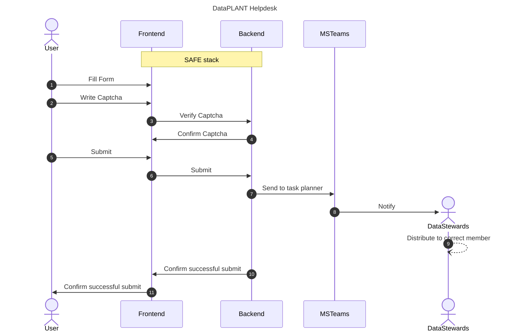

# nfdi-helpdesk

This project is a helpdesk implementation based on the SAFE stack framework for the nfdi4plants/DataPLANT organisation. Some of it's features are:
- Full keyboard support, through nested dropdowns.
- Setting title with entry url query.
- dotnet native and fully customizable image captcha logic.
- Writing input to Microsoft Teams planner tasks.

# Procedure



## Dev

### Run in development

#### Install pre-requisites

You'll need to install the following pre-requisites in order to build SAFE applications

* [.NET Core SDK](https://www.microsoft.com/net/download) 6.0 or higher
* [Node LTS](https://nodejs.org/en/download/)

#### Starting the application

Before you run the project **for the first time only** you must install dotnet "local tools" with this command:

```bash
dotnet tool restore
```

To concurrently run the server and the client components in watch mode use the following command:

```bash
dotnet run
```

Then open `http://localhost:8080` in your browser.

The build project in root directory contains a couple of different build targets. You can specify them after `--` (target name is case-insensitive).

#### Test on native mobile device

Install [localtunnel](https://github.com/localtunnel/localtunnel)

```bash
npm install -g localtunnel
```

Open port on localtunnel api

```bash
lt --port 8080
```

**Tests not implemented**

To run concurrently server and client tests in watch mode (you can run this command in parallel to the previous one in new terminal):

```bash
dotnet run -- RunTests
```
### Docker Publish

Start docker then use: 

```bash 
dotnet run docker-publish
```

__OR__

<details><summary>Step by step</summary>
<p>

1. Create image 
```bash
docker build -t nfdi-helpdesk .
```

2. Test image 
```bash
docker run -it -p 8085:8085 nfdi-helpdesk
```

3. Create tag for image
```bash
docker tag nfdi-helpdesk:latest freymaurer/nfdi-helpdesk:X.X.X
```

Remember to replace "X.X.X" with the correct next SemVer version.

4. Push the image
```bash
docker push freymaurer/nfdi-helpdesk:X.X.X
```

</p>
</details>

### Bundle

#### Fonts for captcha creation

Add fonts as itemgroup to Server.fsproj as such:

```xml
<ItemGroup>
    <Content Update="Fonts\arial.ttf">
      <CopyToOutputDirectory>Always</CopyToOutputDirectory>
    </Content>
    <Content Update="Fonts\times.ttf">
      <CopyToOutputDirectory>Always</CopyToOutputDirectory>
    </Content>
    <Content Update="Fonts\verdana.ttf">
      <CopyToOutputDirectory>Always</CopyToOutputDirectory>
    </Content>
  </ItemGroup>
```

## SAFE Stack Documentation

If you want to know more about the full Azure Stack and all of it's components (including Azure) visit the official [SAFE documentation](https://safe-stack.github.io/docs/).

You will find more documentation about the used F# components at the following places:

* [Saturn](https://saturnframework.org/)
* [Fable](https://fable.io/docs/)
* [Elmish](https://elmish.github.io/elmish/)
